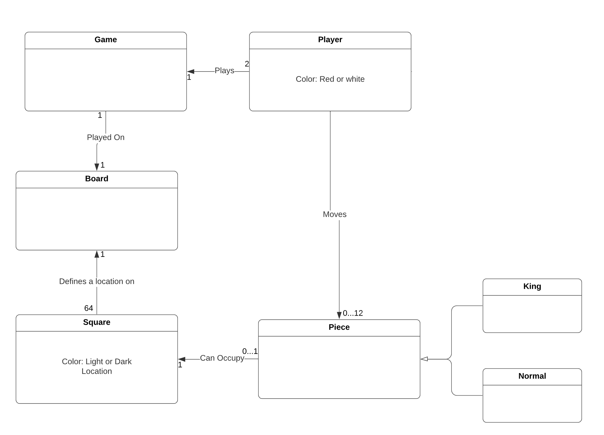
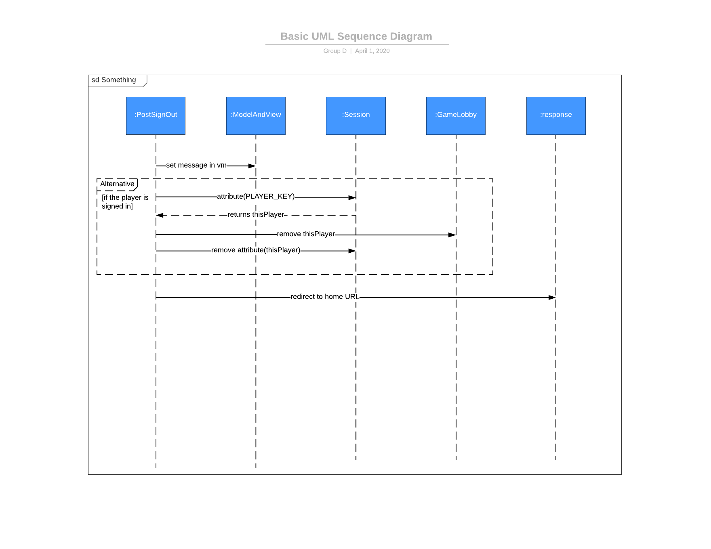
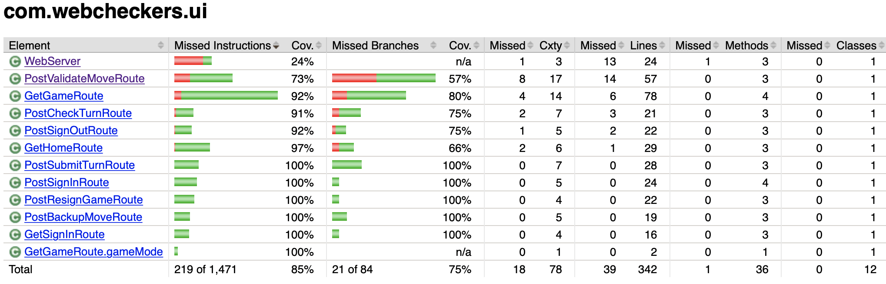

# PROJECT Design Documentation

## Team Information
* Team name: Team D
* Team members
  * Bradley Yoder
  * Ethan Knode
  * Dylan McCann
  * Shubham Malhorta

## Executive Summary

This project host a web server for players to 
log in and play checkers with each other

Players connect to the web server, sign in with a username
then select another player to play a game

### Purpose

The purpose of this project is to develop good software engineering principles
and fundamentals by completing a game based web application as a team.
Throughout the project we practiced good version control with Git,
communication with Slack, and planning with Trello.

### Glossary and Acronyms
A table of terms and acronyms.

| Term | Definition |
|------|------------|
| VO | Value Object |
| MVP | Minimum Viable Product |

## Requirements

This section describes the features of the application including the MVP and future enhancements.

### Definition of MVP
Be able to play a game of checkers against another player under the american rules of checkers

Be able to sign in, sign out, and resign from a game.

### MVP Features

 Story Player Sign in: As a Player I want to sign-in so that I can play a game of checkers.
 
 Story Start a game: As a Player I want to start a game so that I can play checkers with an opponent.
 
 Story Player Sign out: As a Player I want to Sign Out, so that I can leave.
 
 Epic Gameplay: the player plays a game of checkers using the american rules
 
 Epic Resignation: The Player must be able to resign (forfeit) any game he is playing.
 
 Story King Gameplay: As a Player, I was to be kinged at the right time in a game
 so that I can play according to american rules.
 

### Roadmap of Enhancements
 Enhancement Story Moves Help: As a Player, I was to see the possible move that I can make,
 so that I can make them if I need help.

## Application Domain

This section describes the application domain.

A game is played on one board. A board consists of 64 squares which may 
contain a piece which can be of type king or normal.

A game is played by a player with one red player and one white player per game.

## Architecture and Design

This section describes the application architecture.

### Summary

The following Tiers/Layers model shows a high-level view of the webapp's architecture.

As a web application, the user interacts with the system using a
browser.  The client-side of the UI is composed of HTML pages with
some minimal CSS for styling the page.  There is also some JavaScript
that has been provided to the team by the architect.

The server-side tiers include the UI Tier that is composed of UI Controllers and Views.
Controllers are built using the Spark framework and View are built using the FreeMarker framework.  The Application and Model tiers are built using plain-old Java objects (POJOs).

Details of the components within these tiers are supplied below.

### Overview of User Interface

This section describes the web interface flow; this is how the user views and interacts
with the WebCheckers application.

 From the home screen, the player has the option to sign in. While the player is 
 not signed in, they are shown a message with the number of available players
 in the lobby. When the player does sign in with a valid username that is not in use,
 they redirected back to the home page and shown a list of the other available players 
 to play a game. When a player selects another player, as long as both players are
 available they are taken to the start of the game and shown the game board in an
 orientation corresponding to their piece color.

### UI Tier
GetHomeRoute: The user is first brought to the home page through get home route which
servers as the UI controller for the home page. When the user loads the home page they
will only see the number of how many players are signed in. To see the other users and
to play a game, the user will have to sign in.

As shown by the diagram above, when the user clicks on the sign in link, they are directed to
GetSignInRoute which renders the page for GET /signin. When the user enters a name, they are
directed to POST /signin via the PostSignInRoute class. If their name is valid, they will be added
to the PlayerLobby and redirected to the home page. If their name is invalid, they will not be added
to PlayerLobby and will be redirected back to the signin page to input a different name.

With the user signed in and on the home page, they may either select an available player with whom
to begin a game or they can choose to sign out. The sequence diagram below shows the system behavior
for the user to sign out:

When the user chooses to sign out, they will be directed to PostSignOutRoute only if they are not in a game.
Their name will then be removed from teh PlayerLobby and from the session attributes.
They are then redirected to the home page.
If a player is in a game, they must first resign or end the game before signing out.

If the user remains signed in and selects another user, they will be directed to GetGameRoute. In GetGameRoute,
the system will first check if there is an active game for the player. If an active game exists then it is retrieved.
If there is no active game then it will create one and add it to the GameCenter under the names of the two players. 
Whether the game was created or already existed, the data from the game and board are rendered and displayed to the user.
If the user was redirected to GetGameRoute and it is their turn, the list of possible moves they can make is displayed
below the checker board.

Before a player can take action they must wait for their turn. In the waiting for turn state, PostCheckTurnRoute is
invoked every few seconds. When invoked, PostCheckTurnRoute will first get the game associated with the player name
from the GameCenter. It will then check it is the given player's turn. If it is the user's turn or the game is over
for any reason (regardless of whose turn it is) it will return an info message of true. This tells the page to rerender
by invoking GetGameRoute again. If it is not the user's turn and the game is not over then it returns an error message
indicating that it is not yet the user's turn.

When it is the user's turn they are able to move their pieces. First, GetGameRoute will get the game from the GameCenter and
display it to the user (as shown above). The user will then be able to drag and drop pieces on the board. When the user
makes a move, PostValidateMoveRoute is invoked. PostValidateMoveRoute will determine if the selected move is a legal
move on the board based on the American rules of Checkers. If the move is valid, it will be saved but not executed 
in the game class and then the user will be given the options
to backup (undo) their move, or to sumbit their move. If the user chooses to backup their move then PostBackupMoveRoute
is invoked. PostBackupMove will then clear the move stored in the game object. If the user chooses to submit their
move then PostSubmitMoveRoute is invoked. PostSubmitMoveRoute will then tell the game object to execute the move(s)
saved in the object. 

### Application Tier

The PlayerLobby class stores a list of players currently signed into the game. This is updated when a player signs
into or out of the server. It is also used to supply the list of players to the home screen when a user is choosing
and opponent. The add method of PlayerLobby will also verify that a name is not already in use when someone attempts
to sign in. If the name is not already in use, the name will be added to the list and the method will return true. If
the name is already in the list, nothing is added to the list and the method returns false. The PlayerLobby also is
used to check if a player name is valid.

The GameCenter class stores the Game objects for all of the games running on the server. The addGame method
adds a game to the map using the player name as the key. Because the game is added for both players, each game will
have two occurrences in the map with each player name being a key. The method removeGameBoard is used to remove the
game for a given player from the map and is called when a game ends for any reason. This will be called by both players
so that both instances of the game in the map and both keys are removed. The GameCenter class also contains the method
getGame so that the game for a given player key can be retrieved.

### Model Tier

The Piece class represents a Checkers piece that can be type single or king and have color red or white

The Space class represents a space on the Checkers board. Each space has a cell index (x coordinate), a space color
(light or dark), and may have a piece residing on the space. The isValid method returns if the space is a valid spot
for a piece to be placed. It will return true if and only if the space is free (no piece already on the space) and
the space color is dark.

The Row class represents a row on the Checkers board. It contains an array of Space objects and a row index which
represents the y coordinate. The method getSpace(int) will return the space with a given cell index in the row. 
The method replaceSpace is used to replace the space with a given cell index with a different space. The Iterator
and reverse iterator are used to easily iterate over the row when rendering in the game.ftl file. The SpaceIterator and
its reverse define the hasNext() and the next() methods for iterating over the row forwards and backwards respectively.

The BoardView class represents the entire Checkers board. It contains an array of Row objects. The getSpace method is
used to get the space at a given row, column coordinate (where column corresponds to cell index). The RowIterator and its
reverse define the hasNext() and the next() methods for iterating over the board forwards and backwards respectively. The
makeMove method will execute a given move for a given piece color. It will remove the piece at the start coordinates
(stored in the Move object) and place the piece at the end coordinates (also stored in the Move object). If the move spans
more than one row, then the BoardView knows that a jump was made and removes the jumped piece from the board.

The Move class represents a move to be made on the board. It stores the start and end coordinates of the move 
which are represented by a Position object for each.

The Position class represents a position on the board in row, column coordinates 
and contains methods to retrieve the coordinates.

The Game class represents a game of Checkers. It stores a BoardView object for the Checkers board, Strings for the 
red and white player names, the move(s) pending to be made on the board, the current active color corresponding
to the player's who's turn it is, the status of the game (what state the game is in: empty turn, game over, etc.)
and the winner of the game (when applicable). The amIActive method is used to determine if a given player is the
active player (their turn) in the game. setMoveSequenced is used to store pending moves in a list. These
moves are not immediately executed but are used by PostValidateMoveRoute to determine if a move is legal and eventually
are executed upon call from PostSubmitTurnRoute. The clearMoves() method is called by PostBackupMoveRoute and is used 
to clear the pending move from the game object. The MakeMoves() method is used to execute the moves stored. The moves
stored are forwarded to the BoardView makeMove() method. The moves are then cleared. At the end of the method call the
active color is changed via the changeActiveColor() method and the game is checked for endgame conditions (either player 
out of pieces or the next player will be unable to make a move due to all pieces being blocked) via the checkEndGame() method.
The changeActiveColor() method will toggle the active color: if the active color is red then it is set to white, or if it
is white then it is set to red. The checkEndGame() method checks the board for end of game conditions. If either player is
out of pieces, they lose the game - the gameOver boolean is set to true, the winner is set to the other player name, and
the gameEndMsg will reflect that the player ran out of pieces. If the player who will next have to take their turn 
(currently the "inactive player") is blocked and cannot make a move, they lose the game and the gameOver, winner,
and gameEndMsg variables are updated to reflect this. The resign method is called by PostResignGameRoute when a player
chooses to resign. When this method is called, gameOver is set to true, the winner is the player who did not resign, and 
the gameEndMsg will reflect that the player resigned. The emptyState method is used to determine if the game is in the 
empty state. This method will return true if and only if there are no pending moves stored on the game object.

The Player class represents a user on the server and stores the player name. 
Player objects are created when a user signs into the server.

### Design Improvements
As of now, there are not any glaring issues with the design. However, it is important to constantly 
review that the code meets the strong object oriented design principles.

## Testing

### Acceptance Testing
For Sprint 1 we had two stories pass all acceptance criteria. For Sprint 2 we had six stories pass
all acceptance criteria. For Sprint 3 we had 3 two stories pass all acceptance criteria.
No stories in any sprint that have been developed have failed acceptance criteria.

### Unit Testing and Code Coverage
Our unit testing strategy was to obtain as much code coverage as possible to ensure that each class
big or small was working as intended. Nearly all classes in the project contain a unit test class
with the exception of the provided application class and the provided web server class wich proved
difficult to test beyond its constructor.
These unit tests test all of the functionality
of the classes in the application, model, ui, and util tiers.

The cumulative coverage percentage across the tiers was a solid 82 percent.
However, more can be learned by looking at the tiers individually. 

The appl tier was the most covered percentage wise with 98% coverage. Both the PlayerLobby and GameCenter
classes were relatively straightforward tests.

The UI tier was second most covered percentage wise with 85%. However, the UI routes were generally more complex
84 is sufficient. Additionally, this average is being weighed down by the WebServer class which was difficult
to test as stated above.

The model tier had a coverage of 84%. In general, the model tier classes were
relatively straightforward to test.

The util tier also had a coverage of 84%. The util tier was straightforward to test
 as well. However, testing the multiple jump detection with jacoco proved difficult. 

